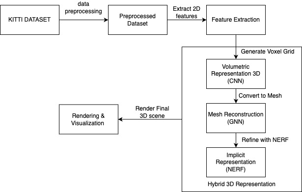

# 🧱 Sparse 2D to 3D Scene Reconstruction using Hybrid Neural Networks

A pipeline for reconstructing detailed 3D outdoor scenes from sparse 2D stereo images using a hybrid neural architecture. The system combines volumetric, mesh, and implicit representations to enhance spatial resolution, trained and tested on the KITTI dataset.

---

## 🏗️ High-Level Architecture



> The pipeline starts with 2D image preprocessing from the KITTI dataset, followed by feature extraction and voxel grid generation. These are passed through 3D CNNs for volumetric representation, then meshed with GNNs, and finally refined using NeRF-based implicit learning for photorealistic rendering.

---

## 🔧 System Flow

### 🖼 Step 1: Data Preprocessing
- Normalize and resize KITTI stereo images
- Generate sparse disparity maps

### 🧠 Step 2: Feature Extraction
- Use CNNs to extract dense spatial features from 2D inputs

### 🧱 Step 3: Voxel Grid + 3D CNN
- Construct voxel grids from extracted features
- Apply 3D convolutions for volumetric representation

### 🕸 Step 4: Mesh Generation + GNN
- Apply marching cubes to convert voxels to mesh
- Refine geometry using Graph Neural Networks

### 🔁 Step 5: NeRF-based Implicit Representation
- Apply NeRF to model lighting and fine geometry
- Output photorealistic scene reconstructions

### 🎥 Step 6: Rendering
- Render final 3D scene with optimized views

---

## 🛠️ Tech Stack

| Component       | Tools / Frameworks             |
|----------------|-------------------------------|
| Dataset         | KITTI (Stereo + Calibration)  |
| Data Handling   | NumPy, OpenCV, TorchVision    |
| Feature Models  | 2D/3D CNNs (PyTorch)          |
| Mesh Network    | PyTorch Geometric, GNN        |
| Implicit Model  | NeRF (PyTorch implementation) |
| Visualization   | Matplotlib, MeshLab, Open3D   |

---

## 💡 Features

- Converts sparse stereo imagery into dense 3D models
- Combines voxel, mesh, and NeRF for high-detail output
- Modular architecture for testing different 3D representations
- Works with real-world outdoor scenes (KITTI)

---

## 🧪 Example Input

**Left Image**: 2D stereo image (KITTI)  
**Right Image**: Corresponding right stereo frame  
**Output**: High-resolution mesh + NeRF-rendered 3D scene

---

## 📦 Installation

```bash
git clone https://github.com/yourusername/sparse-2d-to-3d.git
cd sparse-2d-to-3d
pip install -r requirements.txt
python run_pipeline.py
